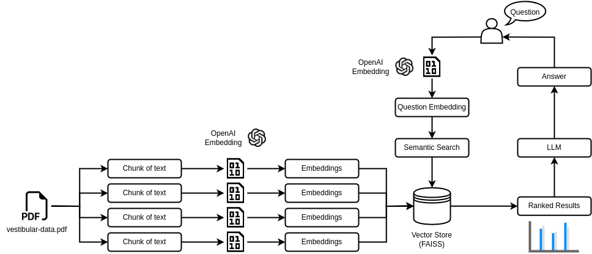

# Chatbot-Vestibular-Unicamp

## Architecture



**Document Processing:**

- PDF Loading: The app reads the file `vestibular-data.pdf` and extracts its text.

- Text Chunking: The extracted text is divided into smaller chunks that can be processed effectively.

- Large Language Model: The application utilizes a LLM to generate vector representations (embeddings) of the text chunks.

- Embeddings Storage: The generated embeddings are stored in a Vector Database (FAISS).

**Query Processing:**

- Similarity Search: When a user asks a question, that question is transformed into an embedding by the same LLM. This embedding is compared with those stored in the Vector Database, identifying and ranking chunks with the most similar content.

- Response Generation: The selected chunks are passed to the LLM, which generates a response based on the content of `vestibular-data.pdf`.

- Conversation Chain: The question and the generated response are stored in a *conversation chain structure* that allows the model to have a *memory* and effectively respond to questions related to previous inquiries.

## Directory Description

- **dataset** - This folder contains the datasets utilized in the process of creating and testing the model.
- **docs** - This folder contains the application architecture image and the notebook that outlines the method for testing and validating the model.
- **vectordb** - This folder cotains the FAISS Vector Store.
- `app.py` - This file contains the code with the interaction between the model and the ChatBot web application hosted on Streamlit.
- `data_processing.py` - This file consists of functions used to extract and process the content from `vestibular-data.pdf`.
- `generate_testset.py` - This script automates the process of creating the test set.
- `model_testing.py` - This script automates the process of testing the model.

## Dependencies and Installation
To install the Chatbot-Vestibular-Unicamp application, follow these steps:

1. Clone the repository to your local machine.
```commandline
git clone https://github.com/vitorpaziam/Chatbot-Vestibular-Unicamp.git
```

2. Create a new virtual enviroment with the required dependencies (using Conda).
```commandline
conda create --name <your enviroment> --file requirements.txt
```

3. Activate the virtual enviroment.
```commandline
conda activate <your enviroment>
```

4. Create a `.env` file in the project directory with your API key from OpenAI.
```commandline
OPENAI_API_KEY=<your API key>
```

## How to run the ChatBot

To start the Chatbot locally, run the `app.py` file using the Streamlit CLI. The application will be launched in your default web browser, displaying the user interface.
```commandline
streamlit run app.py
```

## Model Validation

The process of creating the test set, testing the model, analysis of accuracy, and other discussions are presented in detail at the [model-validation notebook](https://github.com/vitorpaziam/Chatbot-Vestibular-Unicamp/blob/main/docs/model_validation.ipynb).

## References

- [LangChain Retrieval Documentation](https://python.langchain.com/docs/modules/data_connection/)

- [OpenAI API Documentation](https://platform.openai.com/docs/api-reference/)

- [Streamlit ChatBot Tutorial](https://blog.streamlit.io/how-to-build-an-llm-powered-chatbot-with-streamlit/)

- [Ask-Multiple-PDFs Project](https://github.com/alejandro-ao/ask-multiple-pdfs)